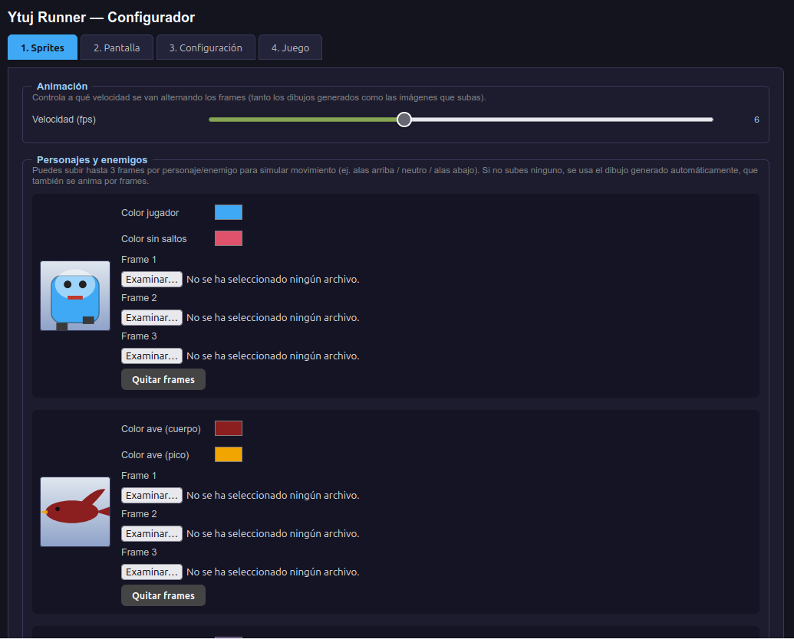
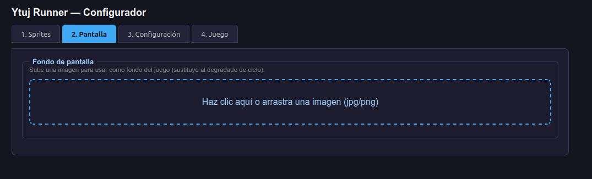
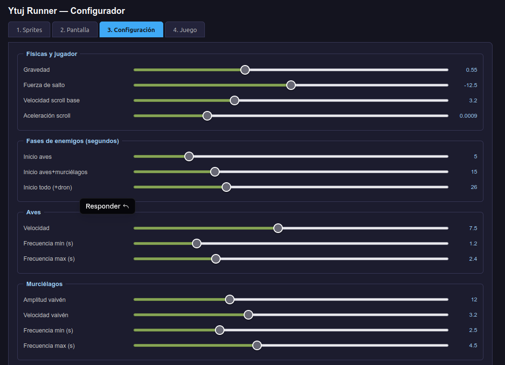
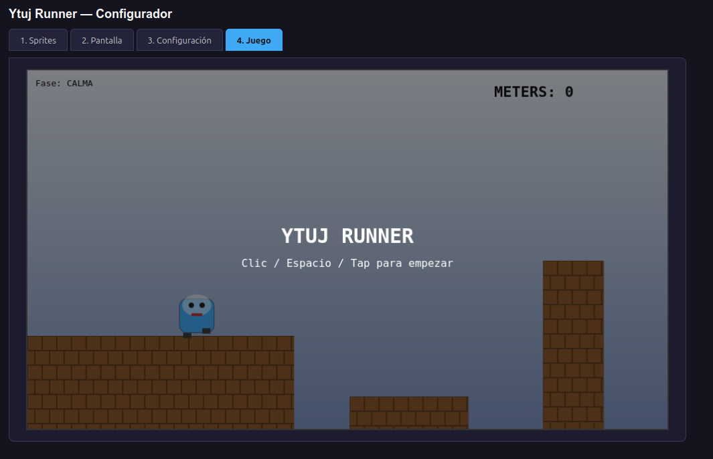

## 🇪🇸 Español


# 🎮 Laboratorio de Juegos Arcade Personalizables

Una colección de videojuegos desarrollados en HTML, CSS y JavaScript que permite a cualquier usuario crear su propia versión de clásicos arcade sin necesidad de programar.

A diferencia de los clones tradicionales, estos proyectos incorporan herramientas de edición visual que permiten modificar sprites, escenarios, reglas de juego, dificultad y comportamiento de los enemigos directamente desde el navegador.

Cada juego se convierte en un pequeño laboratorio de creación donde el jugador puede diseñar sus propios niveles, ajustar la experiencia a su gusto y jugar inmediatamente con los cambios realizados.

\---

# 🕹️ Juegos incluidos

## 🟡 Pac-Man Personalizable

Más que un simple clon de Pac-Man, este proyecto funciona como un editor completo de juegos de laberinto inspirado en el clásico arcade.

### 🎨 Editor de Sprites

* Edición de todos los sprites del juego.
* Hasta 3 frames de animación por elemento.
* Editor pixel-art integrado.
* Vista previa animada.
* Guardado y carga de diseños personalizados.

Elementos editables:

* Jugador
* Enemigos
* Estado vulnerable
* Paredes
* Bolitas
* Poderes
* Proyectiles

### 🗺️ Editor de Laberintos

Tamaños disponibles:

* 15 × 15
* 15 × 21
* 19 × 15
* 19 × 25

Características:

* Creación completa de mapas.
* Teletransportes.
* Posicionamiento de jugador y enemigos.
* Guardado de mapas en JSON.
* Carga de mapas personalizados.

### ⚙️ Configuración avanzada

Permite modificar:

* Vidas iniciales.
* Velocidad del jugador.
* Velocidad de enemigos.
* Disparos enemigos.
* Cadencia de disparo.
* Comportamientos IA.
* Número de pantallas.
* Escalado de dificultad.
* Mensajes personalizados.

### 🎮 Jugar

Prueba inmediatamente cualquier configuración creada por el usuario.

### 📸 Capturas


\---

## 🚀 Space Invaders Personalizable

Versión completamente configurable del clásico Space Invaders.

### 🎨 Editor de Sprites

Elementos editables:

* Nave
* Big Boss
* Enemigo común
* Striker
* Orbiter
* Kamikaze
* ZigZag
* Asteroides
* Planetas

Características:

* Hasta 3 frames de animación.
* Editor pixel-art integrado.
* Vista previa animada.
* Guardado y carga de diseños.

### 🌌 Decoración del escenario

* Fondo personalizado.
* Colocación de asteroides.
* Colocación de planetas.
* Limpieza y restauración de decorados.

### ⚙️ Configuración avanzada

Permite configurar:

* Vida del jugador.
* Daño de proyectiles.
* Vida de enemigos.
* Daño enemigo.
* Puntuación.
* Frecuencia de aparición.
* Oleadas.
* Dificultad progresiva.
* Objetos destructibles.
* Mensajes personalizados.

### 🎮 Jugar

Lanza una partida utilizando todas las modificaciones seleccionadas.

### 📸 Capturas


\---

## 🏰 Pixel Iso Defense (Tower Defense)

Juego Tower Defense con estética isométrica que sigue la filosofía de personalización del resto del laboratorio.

### 🎨 Editor de Sprites y Animaciones

Permite modificar:

* Enemigos
* Torres
* Elementos decorativos
* Objetos del escenario

Características:

* Hasta 3 frames por sprite.
* Vista previa animada.
* Editor pixel-art.
* Guardado y carga de diseños.

### 🗺️ Editor de Nivel

El usuario puede construir completamente el escenario.

Características:

* Creación del camino que recorrerán los enemigos.
* Colocación de árboles, rocas y flores.
* Decoración completa del terreno.
* Generación aleatoria.
* Guardado de niveles.
* Carga de niveles.
* Exportación e importación de terrenos.
* Fondos personalizados.

### ⚙️ Configuración avanzada

Permite modificar numerosos parámetros:

* Vida de torres.
* Daño de torres.
* Coste de construcción.
* Vida de enemigos.
* Resistencia.
* Velocidad de movimiento.
* Recompensas en oro.
* Número de oleadas.
* Enemigos por oleada.
* Dinero inicial.
* Mensajes personalizados de victoria y derrota.

### 🎮 Jugar

Permite probar inmediatamente el nivel y la configuración creados por el jugador.

### 📸 Capturas


\---


## 🏃 Ytuj Runner Personalizable

Endless runner vertical/horizontal personalizable: el jugador salta entre edificios que se van generando sin fin mientras esquiva aves, murciélagos y un dron, siguiendo la misma filosofía de personalización que el resto del laboratorio.

### 🎨 Editor de Sprites

* Edición de todos los elementos del juego mediante colores personalizables.
* Hasta 3 frames de animación por elemento (subiendo tus propias imágenes).
* Si no se sube ninguna imagen, cada elemento se dibuja automáticamente mediante gráficos vectoriales generados por código, también animados por frames.
* Vista previa animada en tiempo real de cada sprite.
* Edificios construidos mediante un mosaico de tiles (color de ladrillo, junta y tamaño configurables).

Elementos editables:

* Jugador
* Ave
* Murciélago
* Dron
* Capa morada (power-up de inmunidad)
* Nube (obstáculo visual de fondo)
* Edificios (tiles)

### 🖼️ Editor de Pantalla

* Subida de una imagen propia como fondo del escenario.
* Opción de quitar el fondo y volver al degradado de cielo por defecto.

### ⚙️ Configuración avanzada

Permite modificar:

* Gravedad y fuerza de salto (con doble salto y salvavidas al caerse sin saltar).
* Velocidad y aceleración del desplazamiento del escenario.
* Frecuencia y timings de aparición de aves, murciélagos y dron por fases.
* Duración y frecuencia de aparición de la nube y de la capa de inmunidad.
* Duración de la inmunidad y opacidad del jugador mientras dura el efecto.
* Huecos y variación de altura entre edificios, con límite automático opcional que calcula matemáticamente el máximo alcanzable con el salto configurado (o control manual total si se desactiva).
* Edificios sólidos o atravesables por los laterales.
* Velocidad de animación (fps) de todos los sprites.

### 🏆 Ranking

* Top 10 mejores marcas guardado en el navegador.
* Introducción de 3 iniciales mediante un carrusel de letras (con flechas arriba/abajo/izquierda/derecha) pensado para funcionar igual de bien en móvil que en PC.
* Temporizador de 30 segundos para introducir las iniciales antes de continuar automáticamente.

### 🔊 Sonido

* Efectos de sonido generados por síntesis (sin archivos externos): salto, graznido de ave, chillido de murciélago, zumbido de dron, campanita de inmunidad (que se acelera según se agota el tiempo) y sonido de muerte.

### 🎮 Jugar

Pantalla de juego independiente que no arranca hasta que el jugador lo decide, probando al instante todos los cambios realizados en sprites, pantalla y configuración.

### 📸 Capturas






\---
## 🛠️ Tecnologías utilizadas

* HTML5
* CSS3
* JavaScript (Vanilla JS)
* Canvas API

\---

## 🚀 Ejecución

Abrir cualquiera de los siguientes archivos en un navegador moderno:

```text
index.html
pac_man_final.html
space_invaders_final.html
tower_defense_final.html
```

No requiere instalación ni dependencias externas.

\---
---

## 🎯 Objetivo del Proyecto

Demostrar cómo los videojuegos arcade clásicos pueden transformarse en herramientas de creación y experimentación, permitiendo que cualquier usuario diseñe sus propias versiones sin conocimientos de programación.

\---

## 👨‍💻 Autor

**Primy**

Proyecto desarrollado con fines educativos y de experimentación en diseño de videojuegos arcade personalizables.


## 🇬🇧 English


# 🎮 Customizable Arcade Games Laboratory

A collection of video games developed in HTML, CSS and JavaScript that allows any user to create their own version of classic arcade games without the need to program.

Unlike traditional clones, these projects incorporate visual editing tools that allow you to modify sprites, scenarios, game rules, difficulty and enemy behavior directly from the browser.

Each game becomes a small creation laboratory where the player can design their own levels, adjust the experience to their liking and immediately play with the changes made.

\---

# 🕹️ Included Games

## 🟡 Customizable Pac-Man

More than just a Pac-Man clone, this project works as a complete maze game editor inspired by the classic arcade.

### 🎨 Sprite Editor

* Editing of all game sprites.
* Up to 3 animation frames per element.
* Integrated pixel-art editor.
* Animated preview.
* Save and load custom designs.

Editable elements:

* Player
* Enemies
* Vulnerable state
* Walls
* Balls
* Power-ups
* Projectiles

### 🗺️ Maze Editor

Available sizes:

* 15 × 15
* 15 × 21
* 19 × 15
* 19 × 25

Features:

* Complete map creation.
* Teleports.
* Player and enemy positioning.
* Save maps in JSON.
* Load custom maps.

### ⚙️ Advanced Configuration

Allows you to modify:

* Initial lives.
* Player speed.
* Enemy speed.
* Enemy shots.
* Fire rate.
* AI behaviors.
* Number of screens.
* Difficulty scaling.
* Custom messages.

### 🎮 Play

Test any configuration created by the user immediately.

### 📸 Screenshots


\---

## 🚀 Customizable Space Invaders

Completely customizable version of the classic Space Invaders.

### 🎨 Sprite Editor

Editable elements:

* Ship
* Big Boss
* Common Enemy
* Striker
* Orbiter
* Kamikaze
* ZigZag
* Asteroids
* Planets

Features:

* Up to 3 animation frames.
* Integrated pixel-art editor.
* Animated preview.
* Save and load designs.

### 🌌 Stage Decoration

* Custom background.
* Asteroid placement.
* Planet placement.
* Clean and restore decorations.

### ⚙️ Advanced Configuration

Allows you to configure:

* Player health.
* Projectile damage.
* Enemy health.
* Enemy damage.
* Score.
* Appearance frequency.
* Waves.
* Progressive difficulty.
* Destructible objects.
* Custom messages.

### 🎮 Play

Launch a game using all selected modifications.

### 📸 Screenshots


\---

## 🏰 Pixel Iso Defense (Tower Defense)

Tower Defense game with isometric aesthetics that follows the customization philosophy of the rest of the laboratory.

### 🎨 Sprite and Animation Editor

Allows you to modify:

* Enemies
* Towers
* Decorative elements
* Stage objects

Features:

* Up to 3 frames per sprite.
* Animated preview.
* Pixel-art editor.
* Save and load designs.

### 🗺️ Level Editor

The user can completely build the stage.

Features:

* Path creation for enemy movement.
* Tree, rock and flower placement.
* Complete terrain decoration.
* Random generation.
* Save levels.
* Load levels.
* Terrain export and import.
* Custom backgrounds.

### ⚙️ Advanced Configuration

Allows you to modify numerous parameters:

* Tower health.
* Tower damage.
* Construction cost.
* Enemy health.
* Resistance.
* Movement speed.
* Gold rewards.
* Number of waves.
* Enemies per wave.
* Starting money.
* Custom victory and defeat messages.

### 🎮 Play

Test the level and configuration created by the player immediately.

### 📸 Screenshots


\---

## 🏃 Customizable Ytuj Runner

Customizable endless runner: the player jumps between endlessly generated buildings while dodging birds, bats and a drone, following the same customization philosophy as the rest of the laboratory.

### 🎨 Sprite Editor

* Editing of every game element through customizable colors.
* Up to 3 animation frames per element (by uploading your own images).
* If no image is uploaded, each element is drawn automatically through code-generated vector graphics, also animated frame by frame.
* Real-time animated preview for every sprite.
* Buildings built from a tile mosaic (brick color, mortar color and tile size configurable).

Editable elements:

* Player
* Bird
* Bat
* Drone
* Purple cape (immunity power-up)
* Cloud (background visual obstacle)
* Buildings (tiles)

### 🖼️ Screen Editor

* Upload your own image as the stage background.
* Option to remove the background and go back to the default sky gradient.

### ⚙️ Advanced Configuration

Allows you to modify:

* Gravity and jump strength (with double jump and a life-saver jump when falling without jumping).
* Scroll speed and acceleration of the stage.
* Spawn frequency and timing of birds, bats and drone across phases.
* Duration and spawn frequency of the cloud and the immunity cape.
* Immunity duration and player opacity while the effect is active.
* Gaps and height variation between buildings, with an optional automatic limit that mathematically calculates the maximum reachable with the configured jump (or full manual control if disabled).
* Buildings solid or passable on their sides.
* Animation speed (fps) for all sprites.

### 🏆 Leaderboard

* Top 10 best scores saved in the browser.
* 3-initial entry through a letter carousel (with up/down/left/right arrows) designed to work equally well on mobile and PC.
* 30-second timer to enter initials before automatically continuing.

### 🔊 Sound

* Synthesized sound effects (no external files): jump, bird caw, bat screech, drone buzz, immunity bell (which speeds up as time runs out) and death sound.

### 🎮 Play

A dedicated game screen that doesn't start until the player decides to, instantly testing every change made in sprites, screen and configuration.

### 📸 Screenshots


\---

## 🛠️ Technologies Used

* HTML5
* CSS3
* JavaScript (Vanilla JS)
* Canvas API

\---

## 🚀 Execution

Open any of the following files in a modern browser:

```text
index.html
pac_man_final.html
space_invaders_final.html
tower_defense_final.html
```

No installation or external dependencies required.
## 🎯 Project Objective

To demonstrate how classic arcade video games can be transformed into creation and experimentation tools, allowing any user to design their own versions without programming knowledge.

\---

## 👨‍💻 Author

**Primy**

Project developed for educational purposes and experimentation in customizable arcade game design.

