## 🇬🇧 Español


# 🎮 Laboratorio de Juegos Arcade Personalizables

Una colección de videojuegos desarrollados en HTML, CSS y JavaScript que permite a cualquier usuario crear su propia versión de clásicos arcade sin necesidad de programar.

A diferencia de los clones tradicionales, estos proyectos incorporan herramientas de edición visual que permiten modificar sprites, escenarios, reglas de juego, dificultad y comportamiento de los enemigos directamente desde el navegador.

Cada juego se convierte en un pequeño laboratorio de creación donde el jugador puede diseñar sus propios niveles, ajustar la experiencia a su gusto y jugar inmediatamente con los cambios realizados.

\---

# 🕹️ Juegos incluidos

## 🟡 Pac-Man Personalizable

Más que un simple clon de Pac-Man, este proyecto funciona como un editor completo de juegos de laberinto inspirado en el clásico arcade.

### 🎨 Editor de Sprites

* Edición de todos los sprites del juego.
* Hasta 3 frames de animación por elemento.
* Editor pixel-art integrado.
* Vista previa animada.
* Guardado y carga de diseños personalizados.

Elementos editables:

* Jugador
* Enemigos
* Estado vulnerable
* Paredes
* Bolitas
* Poderes
* Proyectiles

### 🗺️ Editor de Laberintos

Tamaños disponibles:

* 15 × 15
* 15 × 21
* 19 × 15
* 19 × 25

Características:

* Creación completa de mapas.
* Teletransportes.
* Posicionamiento de jugador y enemigos.
* Guardado de mapas en JSON.
* Carga de mapas personalizados.

### ⚙️ Configuración avanzada

Permite modificar:

* Vidas iniciales.
* Velocidad del jugador.
* Velocidad de enemigos.
* Disparos enemigos.
* Cadencia de disparo.
* Comportamientos IA.
* Número de pantallas.
* Escalado de dificultad.
* Mensajes personalizados.

### 🎮 Jugar

Prueba inmediatamente cualquier configuración creada por el usuario.

### 📸 Capturas

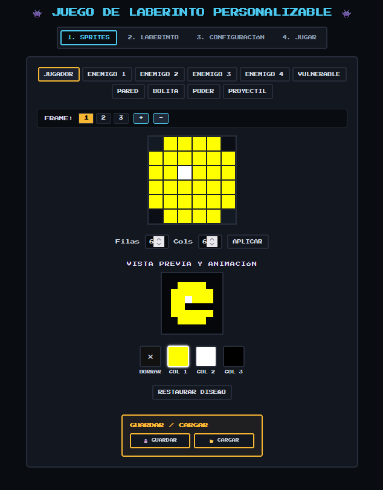

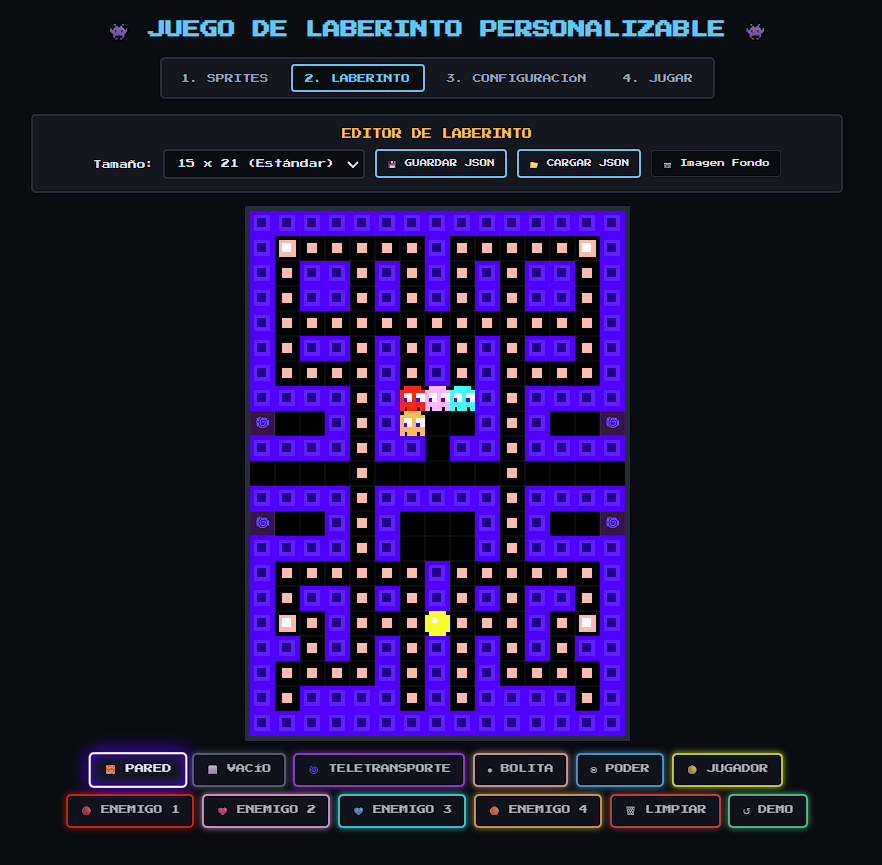

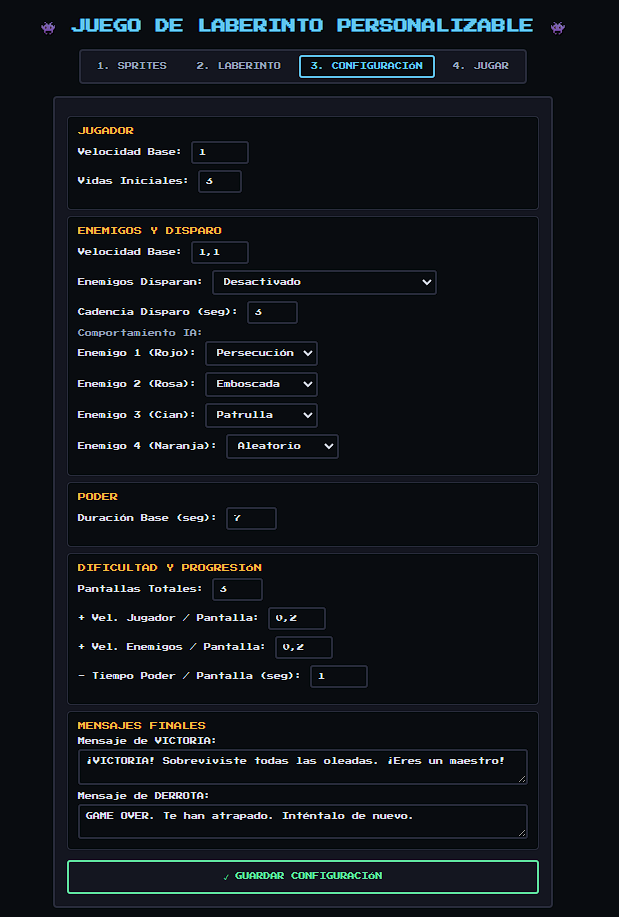

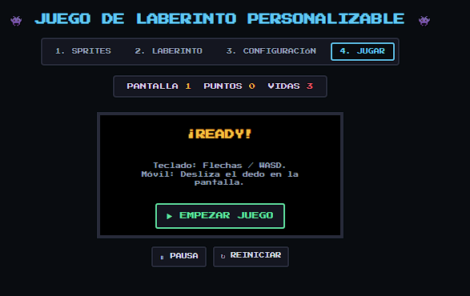


## 🚀 Space Invaders Personalizable

Versión completamente configurable del clásico Space Invaders.

### 🎨 Editor de Sprites

Elementos editables:

* Nave
* Big Boss
* Enemigo común
* Striker
* Orbiter
* Kamikaze
* ZigZag
* Asteroides
* Planetas

Características:

* Hasta 3 frames de animación.
* Editor pixel-art integrado.
* Vista previa animada.
* Guardado y carga de diseños.

### 🌌 Decoración del escenario

* Fondo personalizado.
* Colocación de asteroides.
* Colocación de planetas.
* Limpieza y restauración de decorados.

### ⚙️ Configuración avanzada

Permite configurar:

* Vida del jugador.
* Daño de proyectiles.
* Vida de enemigos.
* Daño enemigo.
* Puntuación.
* Frecuencia de aparición.
* Oleadas.
* Dificultad progresiva.
* Objetos destructibles.
* Mensajes personalizados.

### 🎮 Jugar

Lanza una partida utilizando todas las modificaciones seleccionadas.

### 📸 Capturas

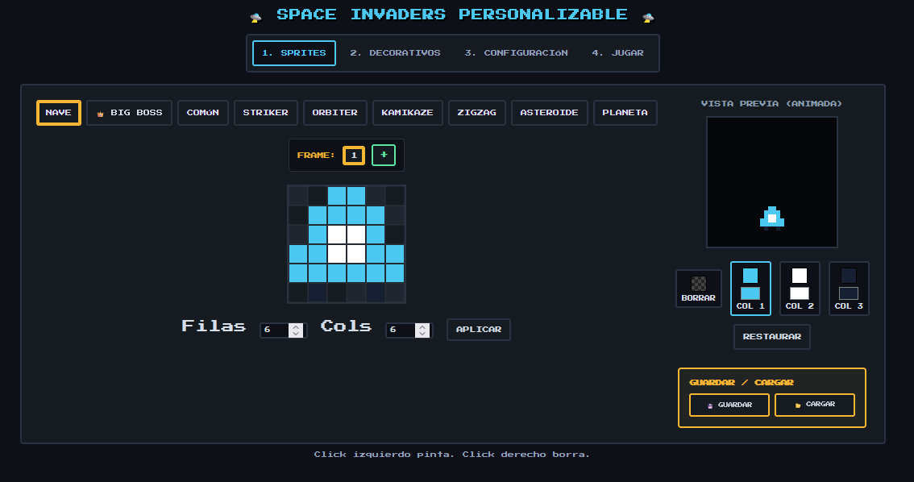
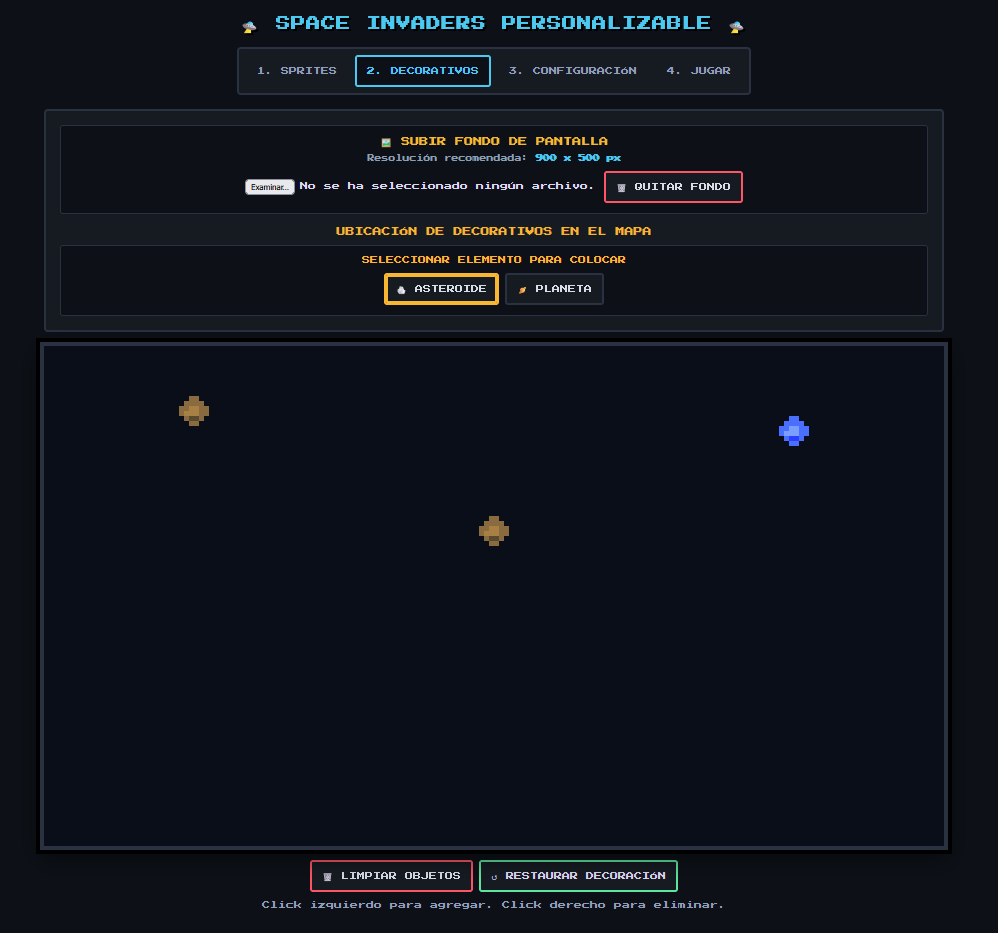
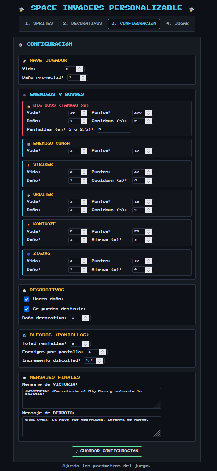
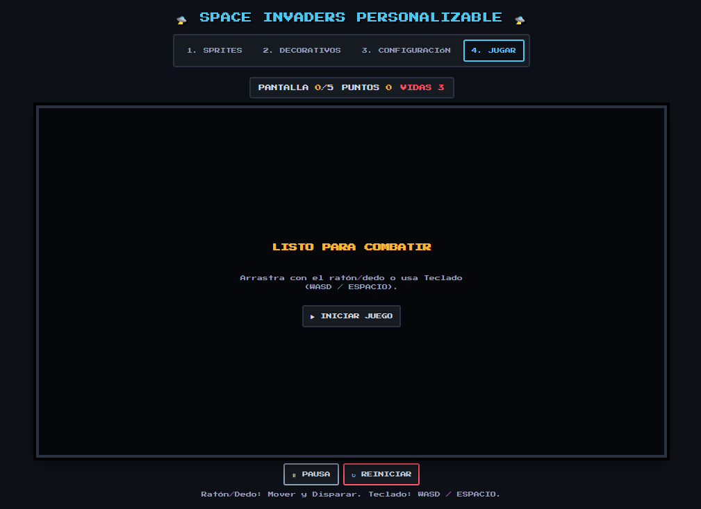

\---

## 🏰 Pixel Iso Defense (Tower Defense)

Juego Tower Defense con estética isométrica que sigue la filosofía de personalización del resto del laboratorio.

### 🎨 Editor de Sprites y Animaciones

Permite modificar:

* Enemigos
* Torres
* Elementos decorativos
* Objetos del escenario

Características:

* Hasta 3 frames por sprite.
* Vista previa animada.
* Editor pixel-art.
* Guardado y carga de diseños.

### 🗺️ Editor de Nivel

El usuario puede construir completamente el escenario.

Características:

* Creación del camino que recorrerán los enemigos.
* Colocación de árboles, rocas y flores.
* Decoración completa del terreno.
* Generación aleatoria.
* Guardado de niveles.
* Carga de niveles.
* Exportación e importación de terrenos.
* Fondos personalizados.

### ⚙️ Configuración avanzada

Permite modificar numerosos parámetros:

* Vida de torres.
* Daño de torres.
* Coste de construcción.
* Vida de enemigos.
* Resistencia.
* Velocidad de movimiento.
* Recompensas en oro.
* Número de oleadas.
* Enemigos por oleada.
* Dinero inicial.
* Mensajes personalizados de victoria y derrota.

### 🎮 Jugar

Permite probar inmediatamente el nivel y la configuración creados por el jugador.

### 📸 Capturas

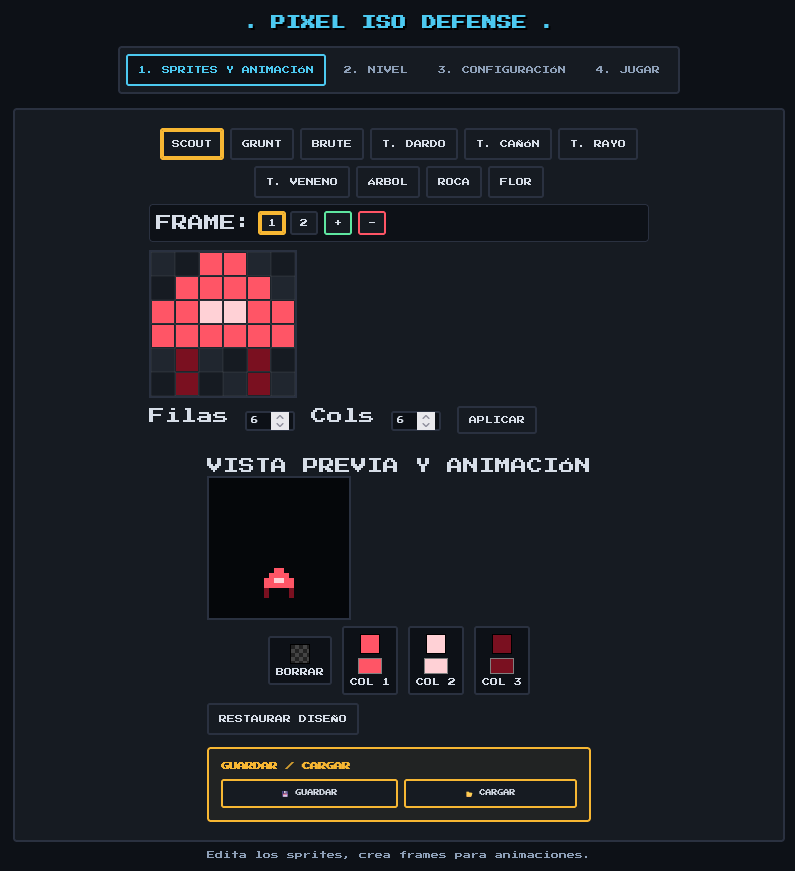
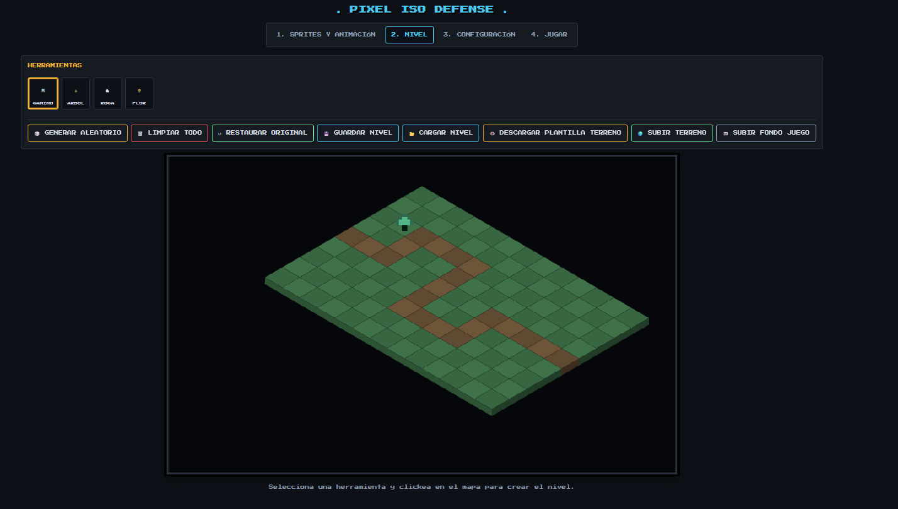
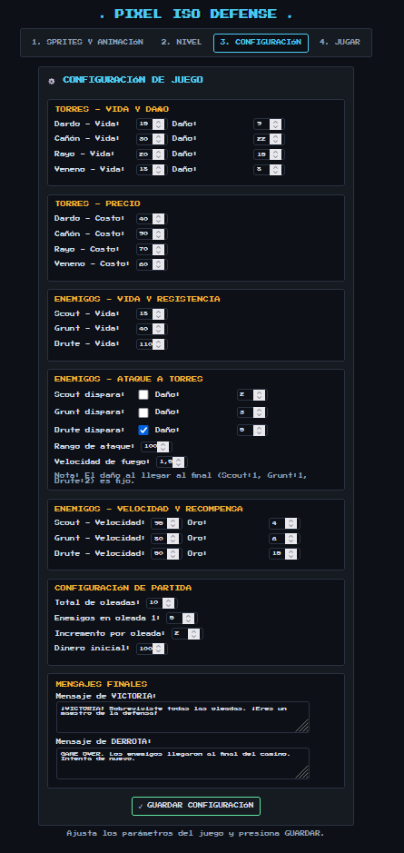
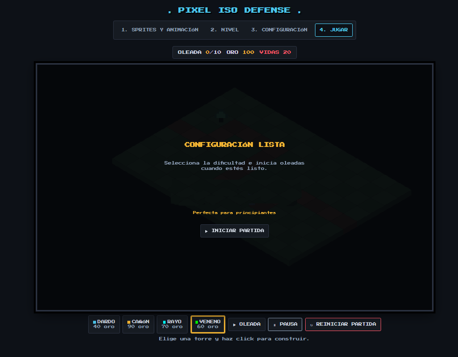


\---

## 🛠️ Tecnologías utilizadas

* HTML5
* CSS3
* JavaScript (Vanilla JS)
* Canvas API

\---

## 🚀 Ejecución

Abrir cualquiera de los siguientes archivos en un navegador moderno:

```text
pac\_man\_final.html
space\_invaders\_final.html
tower\_defense\_final.html
```

No requiere instalación ni dependencias externas.

\---

## 🎯 Objetivo del Proyecto

Demostrar cómo los videojuegos arcade clásicos pueden transformarse en herramientas de creación y experimentación, permitiendo que cualquier usuario diseñe sus propias versiones sin conocimientos de programación.

\---

## 👨‍💻 Autor

**Primy**

Proyecto desarrollado con fines educativos y de experimentación en diseño de videojuegos arcade personalizables.


## 🇬🇧 English


# 🎮 Customizable Arcade Games Laboratory

A collection of video games developed in HTML, CSS and JavaScript that allows any user to create their own version of classic arcade games without the need to program.

Unlike traditional clones, these projects incorporate visual editing tools that allow you to modify sprites, scenarios, game rules, difficulty and enemy behavior directly from the browser.

Each game becomes a small creation laboratory where the player can design their own levels, adjust the experience to their liking and immediately play with the changes made.

\---

# 🕹️ Included Games

## 🟡 Customizable Pac-Man

More than just a Pac-Man clone, this project works as a complete maze game editor inspired by the classic arcade.

### 🎨 Sprite Editor

* Editing of all game sprites.
* Up to 3 animation frames per element.
* Integrated pixel-art editor.
* Animated preview.
* Save and load custom designs.

Editable elements:

* Player
* Enemies
* Vulnerable state
* Walls
* Balls
* Power-ups
* Projectiles

### 🗺️ Maze Editor

Available sizes:

* 15 × 15
* 15 × 21
* 19 × 15
* 19 × 25

Features:

* Complete map creation.
* Teleports.
* Player and enemy positioning.
* Save maps in JSON.
* Load custom maps.

### ⚙️ Advanced Configuration

Allows you to modify:

* Initial lives.
* Player speed.
* Enemy speed.
* Enemy shots.
* Fire rate.
* AI behaviors.
* Number of screens.
* Difficulty scaling.
* Custom messages.

### 🎮 Play

Test any configuration created by the user immediately.

### 📸 Screenshots


## 🚀 Customizable Space Invaders

Completely customizable version of the classic Space Invaders.

### 🎨 Sprite Editor

Editable elements:

* Ship
* Big Boss
* Common Enemy
* Striker
* Orbiter
* Kamikaze
* ZigZag
* Asteroids
* Planets

Features:

* Up to 3 animation frames.
* Integrated pixel-art editor.
* Animated preview.
* Save and load designs.

### 🌌 Stage Decoration

* Custom background.
* Asteroid placement.
* Planet placement.
* Clean and restore decorations.

### ⚙️ Advanced Configuration

Allows you to configure:

* Player health.
* Projectile damage.
* Enemy health.
* Enemy damage.
* Score.
* Appearance frequency.
* Waves.
* Progressive difficulty.
* Destructible objects.
* Custom messages.

### 🎮 Play

Launch a game using all selected modifications.

### 📸 Screenshots


\---

## 🏰 Pixel Iso Defense (Tower Defense)

Tower Defense game with isometric aesthetics that follows the customization philosophy of the rest of the laboratory.

### 🎨 Sprite and Animation Editor

Allows you to modify:

* Enemies
* Towers
* Decorative elements
* Stage objects

Features:

* Up to 3 frames per sprite.
* Animated preview.
* Pixel-art editor.
* Save and load designs.

### 🗺️ Level Editor

The user can completely build the stage.

Features:

* Path creation for enemy movement.
* Tree, rock and flower placement.
* Complete terrain decoration.
* Random generation.
* Save levels.
* Load levels.
* Terrain export and import.
* Custom backgrounds.

### ⚙️ Advanced Configuration

Allows you to modify numerous parameters:

* Tower health.
* Tower damage.
* Construction cost.
* Enemy health.
* Resistance.
* Movement speed.
* Gold rewards.
* Number of waves.
* Enemies per wave.
* Starting money.
* Custom victory and defeat messages.

### 🎮 Play

Test the level and configuration created by the player immediately.

### 📸 Screenshots


\---

## 🛠️ Technologies Used

* HTML5
* CSS3
* JavaScript (Vanilla JS)
* Canvas API

\---

## 🚀 Execution

Open any of the following files in a modern browser:

```text
pac_man_final.html
space_invaders_final.html
tower_defense_final.html
```

No installation or external dependencies required.

\---

## 🎯 Project Objective

To demonstrate how classic arcade video games can be transformed into creation and experimentation tools, allowing any user to design their own versions without programming knowledge.

\---

## 👨‍💻 Author

**Primy**

Project developed for educational purposes and experimentation in customizable arcade game design.

